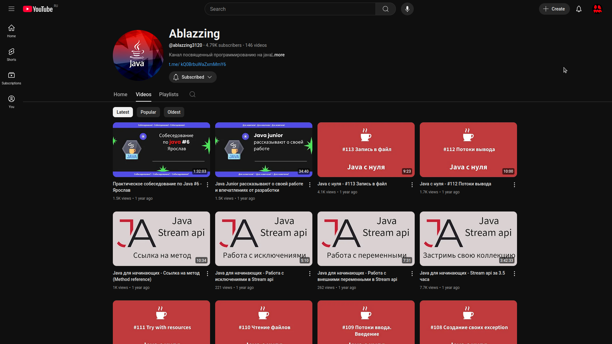

This is a collection of educational material on Java.
I am adding to it as I watch this video course: https://bit.ly/43IsTqe

This project is more suitable as a cheat sheet or repetition, but for learning, watch other people's courses!